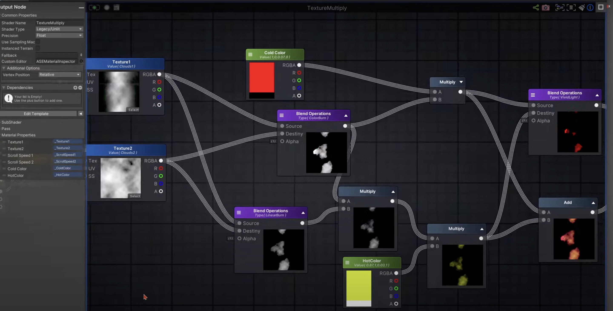
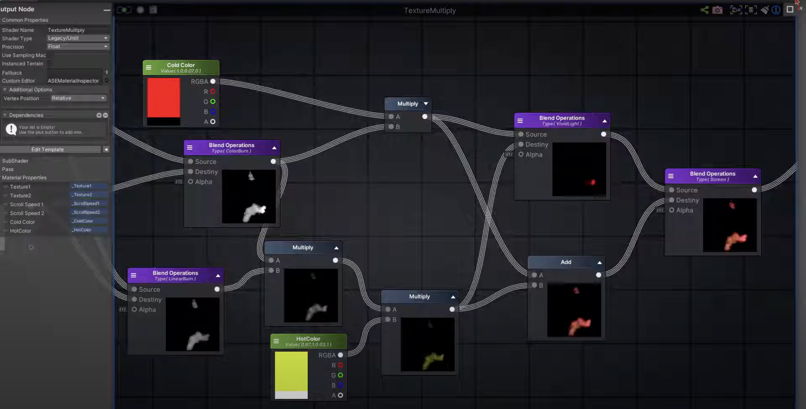

# Texture Scrolling & UV Tricks
### [source video](https://youtu.be/fOZiaSkDyRk)
## Techniques
* Blizzard style multiply multiple textures with scrolling to get simple but fairly impressive fire, plasma, etc
	
	

	

* **UV scaling and distortion**
	* add irregular noise to UVs to simulate things like water
	* Scale parts of the UVs bigger or smaller to simulate waterfall going over the edge of a cliff
	* Scale narrow to only use parts of the texture to create waves 
  
* **Cluster Compression** 
	* scale and position UVs in such a way that when the texture scrolls, it will look like a traffic light		

	* Another example is to separate and scale UV polys so when transparent texture is scrolled across they randomly appear or disappear like GodRays	

	
* **Disarranged Clusters**
	* Example: separate UV islands scaled to 0 on the x axis so that when texture scrolls across it looks like soundbars on an equalizer		

* **Pulsing Gradients**
	* Also by scaling UVs to 0 on one axis but also moving parts around to be light/dark you can simulate pulsing screens or lights with just a single texture.

* **Radial Motion** 
	* By splitting apart and arranging UVs of a disc to be aligned to a square you can get a radar sweep type effect
		Radial Motion.png
		Same technique for a vinyl record spinning:		

* **Deformed Textures**
	* By combining a wavy texture in addition to distorted UVs you can create something like a wavy flag without sprite sheets or animated texture
		* The right side of the UVs has a split to create the point of the flag. The split and spreading the UVs out prevents the mesh from displaying the flag texture most of the time.			

* **Data Texture** 
	* With similar techniques as shown - UVs scaled to zero on the x axis and a layout of colored blocks in a texture you can create a digital counter by panning the UVs from left to right.

* **Texture Direction**
	* similar to previous examples but this time you have a diagonal glow stripe texture and flattened arrows from an Arrow shaped geo. pan the UVs across the diagonal glow texture to create an animated directional arrow	

